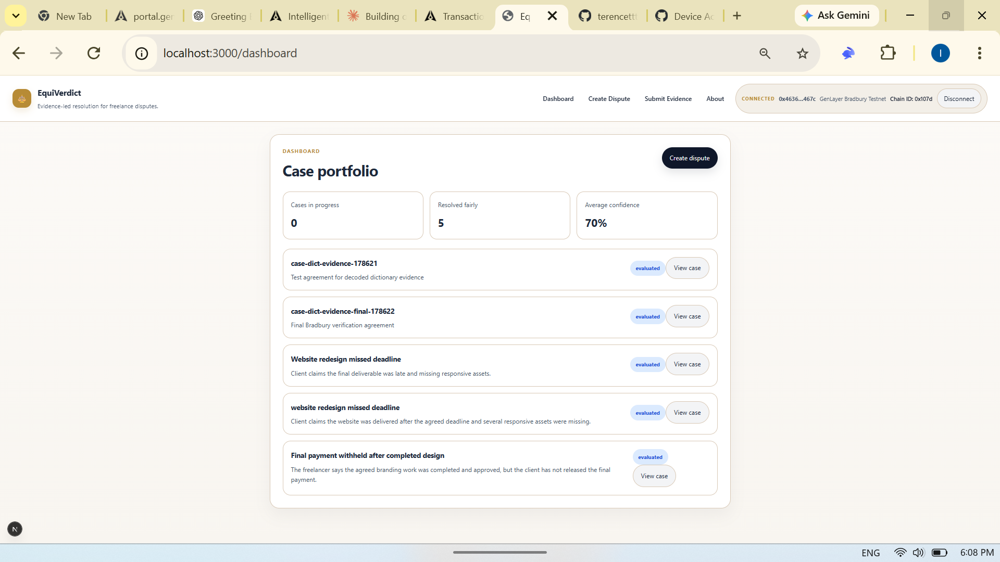
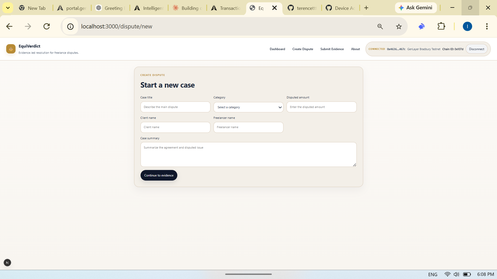
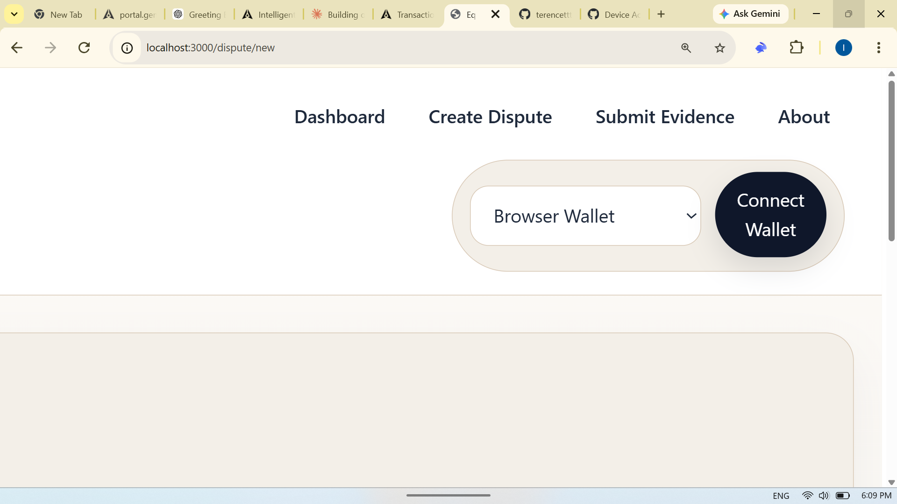
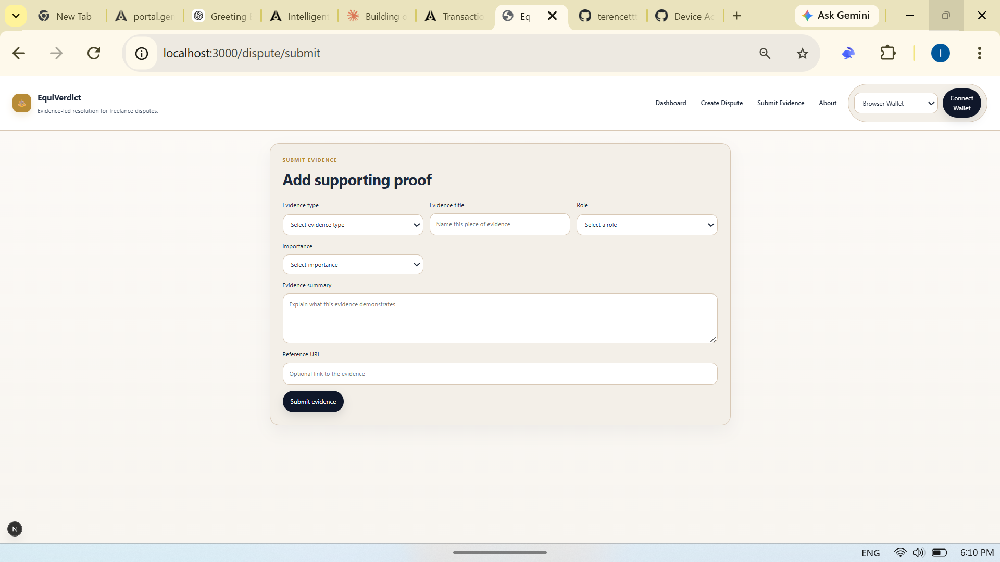
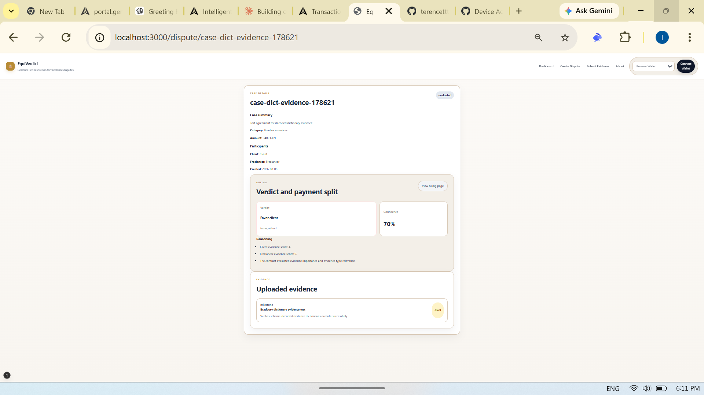

# EquiVerdict

EquiVerdict is an evidence-led freelance dispute resolution dApp that uses a GenLayer Intelligent Contract to evaluate submitted evidence and produce a transparent settlement recommendation.

## Live Demo

[Launch EquiVerdict](https://equiverdict.vercel.app)

## Overview

EquiVerdict gives clients and freelancers a structured way to record a dispute, submit supporting evidence, and receive an on-chain verdict. The application presents the contract's decision, confidence score, suggested payment split, reasoning, and recommended next action in a clear case dashboard.

The current deployment runs on the **GenLayer Bradbury Testnet**.

## Problem

Freelance disputes often depend on fragmented information such as milestone records, conversations, invoices, screenshots, and delivery notes. Without a consistent review process, disagreements about scope, delivery, and payment can become slow, subjective, and difficult to audit.

## Solution

EquiVerdict turns dispute details and evidence into a structured contract call. Its GenLayer Intelligent Contract:

- validates the case and evidence;
- scores evidence by importance and type relevance;
- compares the client and freelancer evidence weights;
- stores the evaluated case on-chain; and
- returns an explainable settlement recommendation.

The current contract uses a deterministic evidence-weighting rubric. It does not claim to replace legal advice, arbitration, or human judgment.

## How It Works

1. A user connects a compatible injected EVM wallet.
2. The app verifies or requests a switch to GenLayer Bradbury Testnet.
3. The user enters the dispute details.
4. The user adds one evidence item for either the client or freelancer.
5. The wallet signs a `submit_dispute` transaction.
6. The frontend waits for GenLayer consensus and verifies that execution finished successfully.
7. The dashboard and case pages read the stored dispute and display its verdict.

## Key Features

- Structured dispute and evidence submission
- Wallet-signed GenLayer transactions
- On-chain case storage and retrieval
- Evidence-based verdict category and decision label
- Confidence score and suggested payment split
- Human-readable reasoning and recommended next action
- Dashboard populated from live contract state
- Detailed transaction, receipt, and GenVM error reporting
- Responsive, professional interface

## GenLayer Integration

The frontend uses `genlayer-js` with separate read and wallet-backed write clients.

- Read operations query Bradbury directly without requiring a wallet signature.
- Write operations use the selected injected wallet provider.
- Before submission, the frontend verifies the deployed `submit_dispute` schema.
- After submission, it waits for an `ACCEPTED` receipt and confirms `FINISHED_WITH_RETURN` rather than treating lifecycle acceptance alone as execution success.
- If execution fails, the UI retrieves the GenVM trace and displays the transaction hash, receipt status, and execution error.

## Architecture

```text
Browser UI (Next.js / React)
        |
        |-- EIP-6963 discovery / EIP-1193 provider
        |-- wallet_addEthereumChain / wallet_switchEthereumChain
        |
        v
genlayer-js read and write clients
        |
        v
GenLayer Bradbury Testnet
        |
        v
FreelanceDisputeResolver Intelligent Contract
        |
        |-- TreeMap: serialized disputes
        `-- DynArray: case ordering
```

There is no application backend or off-chain database in the current implementation. Case history shown by the dashboard comes from the deployed Intelligent Contract.

## Tech Stack

- **Framework:** Next.js 16
- **UI:** React 19 and CSS
- **Language:** TypeScript
- **Blockchain SDK:** `genlayer-js`
- **Contract language:** Python for GenVM
- **Network:** GenLayer Bradbury Testnet
- **Wallet standards:** EIP-6963 and EIP-1193

## Smart Contract

- **Contract:** `FreelanceDisputeResolver`
- **Network:** GenLayer Bradbury Testnet
- **Address:** `0xb3d23b867ab6aca59e5b3915157e1bbf1309966b`
- **Source:** [`contracts/dispute_resolver.py`](contracts/dispute_resolver.py)

Public methods:

### `submit_dispute`

Creates and evaluates a dispute using:

```text
case_id
agreement
disputed_amount
client_evidence
freelancer_evidence
```

At least one of the two evidence arrays must contain an item. Each evidence item contains `type`, `role`, `title`, `summary`, `importance`, `timestamp`, and `url`.

### `get_dispute`

Returns one stored dispute by its case ID, including its evidence, status, submitter, and verdict.

### `list_disputes`

Returns all stored disputes in submission order. The dashboard uses this method as its case-history source.

The verdict includes:

- verdict category;
- decision label;
- confidence score;
- client/freelancer payment split;
- reasoning statements; and
- recommended next action.

## Wallet Support

EquiVerdict supports compatible injected EVM browser wallets; it is not restricted to a specific wallet brand.

- **EIP-6963:** discovers multiple installed wallets individually and shows a wallet selector when needed.
- **EIP-1193:** requests accounts, reads the active chain, switches networks, adds Bradbury when missing, and sends signed transactions.
- **Fallback:** uses `window.ethereum` or `window.ethereum.providers` when EIP-6963 is unavailable.

Disconnecting clears the app's selected provider and displayed account. Wallet account management remains controlled by the wallet extension.

## Getting Started

Prerequisites:

- Node.js and npm
- A compatible injected EVM browser wallet
- Bradbury testnet GEN for transaction fees

Install dependencies:

```bash
npm install
```

Start the development server:

```bash
npm run dev
```

Open [http://localhost:3000](http://localhost:3000) in a browser.

## Local Development

Available commands:

```bash
# Run the Next.js development server
npm run dev

# Create an optimized production build
npm run build

# Run the production server after building
npm run start
```

The repository also contains a Python contract specification in [`tests/contract_spec.py`](tests/contract_spec.py). It requires a configured GenLayer testing environment and is separate from the frontend npm scripts.

## Environment / Network

The current frontend does not require environment variables. Its active network and deployed contract are defined in the source:

| Setting | Value |
| --- | --- |
| Network | GenLayer Bradbury Testnet |
| Chain ID (hex) | `0x107d` |
| Chain ID (decimal) | `4221` |
| Contract | `0xb3d23b867ab6aca59e5b3915157e1bbf1309966b` |

The app requests Bradbury through the wallet when necessary. Never commit wallet private keys, seed phrases, or account keystores.

## Project Structure

```text
app/
├── components/WalletNav.tsx    # Wallet discovery, selection, and status UI
├── dashboard/page.tsx          # On-chain case portfolio
├── dispute/
│   ├── [id]/page.tsx           # Case details
│   ├── new/page.tsx            # Dispute intake form
│   └── submit/page.tsx         # Evidence and transaction submission
├── lib/
│   ├── cases.ts                # Application models and contract-data mapping
│   ├── genlayer.ts             # Contract reads, writes, receipts, and traces
│   └── wallet.ts               # EIP-6963/EIP-1193 wallet utilities
├── ruling/page.tsx             # Verdict and payment recommendation
├── globals.css                 # Application styling
├── layout.tsx                  # Shared navigation and wallet controls
└── page.tsx                    # Landing page

contracts/
└── dispute_resolver.py         # GenLayer Intelligent Contract

tests/
└── contract_spec.py            # Contract behavior specification
```

## Example User Flow

1. Select **Connect Wallet** and choose an injected wallet if multiple providers are installed.
2. Approve the Bradbury network switch when requested.
3. Open **Create Dispute** and enter the parties, category, amount, and agreement summary.
4. Continue to **Submit Evidence** and describe one supporting item.
5. Approve the contract transaction in the wallet.
6. Wait for Bradbury consensus and execution verification.
7. Review the case, evidence, confidence score, payment split, rationale, and recommended next action.

## Screenshots

### Dashboard

The dashboard provides an at-a-glance view of dispute activity and makes it easy to review cases stored on GenLayer.



### Create Dispute

The dispute creation screen captures the parties, category, disputed amount, and agreement details in a clear, guided workflow.



### Connect Wallet

The wallet connection interface lets users securely select a compatible injected wallet before interacting with the GenLayer network.



### Submit Evidence

The evidence submission screen enables a party to provide structured supporting information for evaluation by the Intelligent Contract.



### Intelligent Verdict

This screen demonstrates a completed GenLayer dispute evaluation, showing the verdict, confidence score, reasoning, and uploaded evidence.



## Future Improvements

- Accept multiple evidence items from both parties before submission
- Support evidence attachments through content-addressed storage
- Add explicit appeal and case-status workflows
- Add participant permissions and party-specific submissions
- Improve contract indexing and pagination for larger case histories
- Expand automated frontend and Bradbury integration test coverage
- Introduce privacy-preserving evidence handling for sensitive disputes

## Security / Privacy Notes

- Submitted dispute data is stored on a public testnet and should be treated as publicly readable.
- Do not submit confidential documents, personal secrets, private keys, seed phrases, or regulated personal data.
- Reference URLs may expose information to anyone who can read the contract state.
- The current verdict is a deterministic recommendation and is not legal advice or a binding arbitration decision.
- Users should verify wallet transaction details and the Bradbury network before signing.
- This is a testnet builder submission and has not undergone a formal security audit.

## License

This project is licensed under the ISC License, as declared in `package.json`.

## Author / Submission

EquiVerdict was built as a GenLayer builder submission focused on transparent, evidence-led freelance dispute resolution.

- **Project:** EquiVerdict
- **Submission:** GenLayer vibecoding competition
- **Network:** GenLayer Bradbury Testnet
