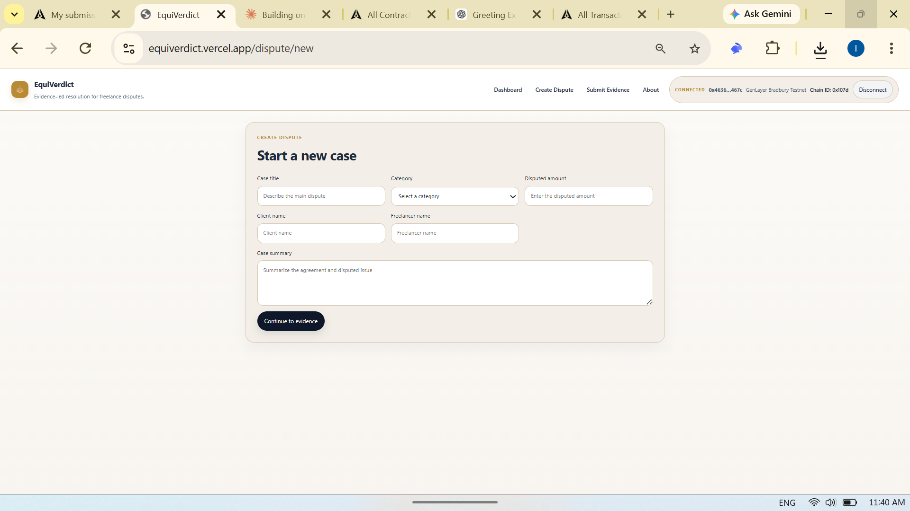
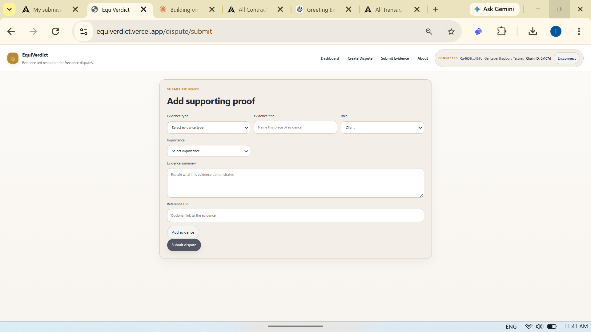
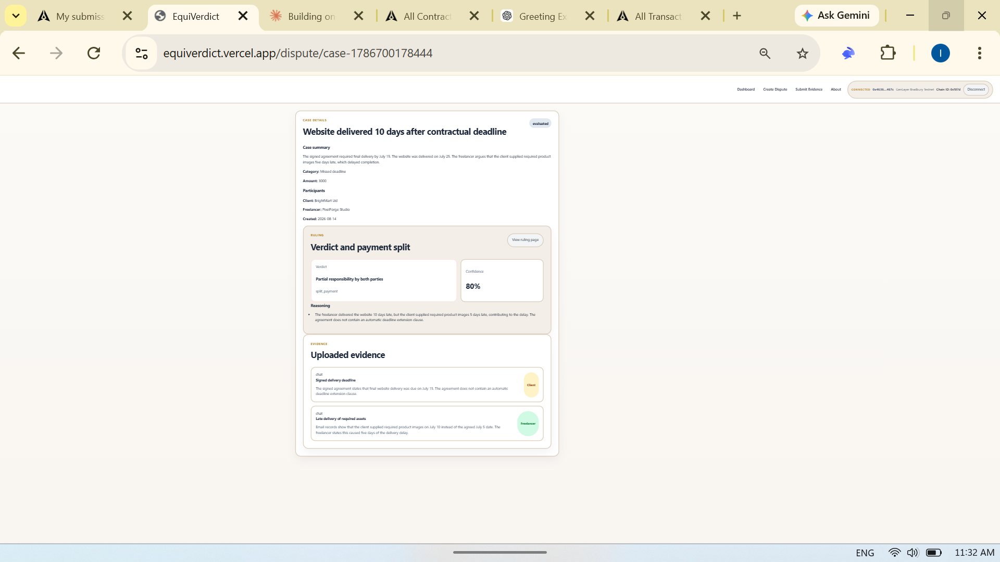

# EquiVerdict

**Evidence-led freelance dispute resolution on GenLayer.**

EquiVerdict is a decentralized application for structured freelance dispute resolution. Clients and freelancers submit the dispute terms and supporting evidence, and a GenLayer Intelligent Contract evaluates both sides through nondeterministic execution and validator consensus before producing a transparent, on-chain outcome.

## Source and deployment status

- **CURRENT SOURCE:** `contracts/dispute_resolver.py` is the corrected local contract. It requires mutual agreement acceptance, explicit evidence freeze, an ordered evidence root, material findings and validator grounding; payout tolerance is 5 percentage points.
- **DEPLOYMENT:** User-confirmed live Studionet contract: `0x68B14610F08d3a58232E5e2fe791BAc6E26D0679`.
- **Historical app URL:** https://equiverdict.vercel.app (not verified against the corrected source).
- **Network:** GenLayer Studionet, chain ID `61999` (`0xf22f`), RPC `https://studio.genlayer.com/api`.
- **Unknown provenance / former frontend candidate:** `0x6dD436Fe2Cb40486f7D60Ca02161B05f90B319ce` appeared in the frontend and working README before this alignment. It is not the canonical corrected deployment.
- **Stale historical candidate:** `0x1e3F5ffAa55c891b30b2b920eEE65E5e154b5aFe` appears in backups, captured context and historical README output. It is not the canonical corrected deployment.

The frontend has no address fallback. Set `NEXT_PUBLIC_GENLAYER_CONTRACT_ADDRESS` through the existing Next.js `.env.local` / build environment mechanism and rebuild. If unset, reads and writes fail with a configuration message. See `.env.example` and [the local source-of-truth audit](docs/equiverdict-source-of-truth.md).

## Why EquiVerdict

Freelance disputes often depend on fragmented evidence: contracts, milestone records, delivery notes, conversations, invoices, screenshots, and scope changes.

Without a consistent review process, disagreements about quality, deadlines, scope, and payment can become subjective and difficult to audit.

EquiVerdict turns that evidence into a structured GenLayer dispute workflow where both parties are represented before the contract produces a consensus-backed recommendation.

## How It Works (current local source)

1. **Create:** The client binds separate party wallets and a canonical, versioned JSON agreement containing the agreed terms. The exact agreement bytes and SHA-256 are shown.
2. **Accept:** Each bound wallet calls `accept_agreement(case_id, agreement_sha256)` separately. Creation does not imply acceptance.
3. **Submit evidence:** After mutual acceptance, each party submits evidence using the accepted agreement hash, a required public HTTPS URI and SHA-256 of its exact content bytes. Roles come from transaction senders.
4. **Freeze:** Either party calls `freeze_evidence(case_id)` after both have submitted at least one item. The ordered provenance records are committed to `evidence_root`; further evidence is permanently blocked.
5. **Evaluate:** Evaluation is available only after freeze. Validators fetch and hash-check evidence, compare independent outcomes within the 5-point payout tolerance, and check material findings, citations, explanation and payout consistency.
6. **Read:** `get_dispute` and `list_disputes` return agreement acceptance, evidence provenance, freeze/root and verdict fields. There is no `get_case` method or separate evidence/verdict read method.
7. **Unresolved consensus:** The frozen case remains unchanged and can be retried. Changed terms or additional evidence require a new case.

## Consensus Output

A successful dispute can return:

- **Verdict**
- **Confidence score**
- **Payment recommendation / split**
- **Material findings and cited evidence IDs**
- **Grounded explanation**
- **Recommended next action**

Validators check semantic grounding of the explanation and findings against verified evidence, in addition to comparing constrained decision fields.

## Historical screenshots (not validation of corrected source)

### Create a dispute

Users define the dispute, participants, category, disputed amount, and agreement context before submitting evidence.



### Submit evidence from both parties

EquiVerdict supports structured evidence from both the Client and Freelancer.



### Consensus-backed verdict

This historical screenshot illustrates the earlier verdict interface; it does not establish deployment of the corrected contract.



## Historical demo reports (not current deployment verification)

Earlier project notes reported the following demo scenarios; these have not been rerun against a verified deployment of the corrected source:

- **Deadline dispute:** both parties contributed to the delay; the contract returned a shared-responsibility outcome.
- **Payment / scope dispute:** the freelancer completed the agreed scope while the client requested extra features afterward; consensus favored payment for completed scope.
- **Quality / defect dispute:** the work was delivered with verifiable defects; consensus produced a split-payment recommendation.
- **Ambiguous dispute:** validators could not reach consensus; the frontend correctly handled `UNDETERMINED` without navigating to a nonexistent case.

Current automated checks are local and mocked where web/LLM or wallet access is needed. They do not prove live consensus or deployment provenance.

## Intelligent Contract

Primary contract:

```text
contracts/dispute_resolver.py
```
